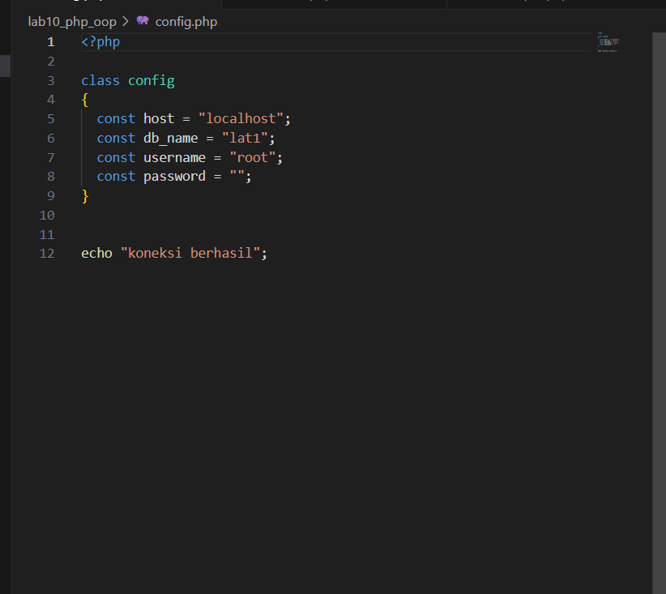
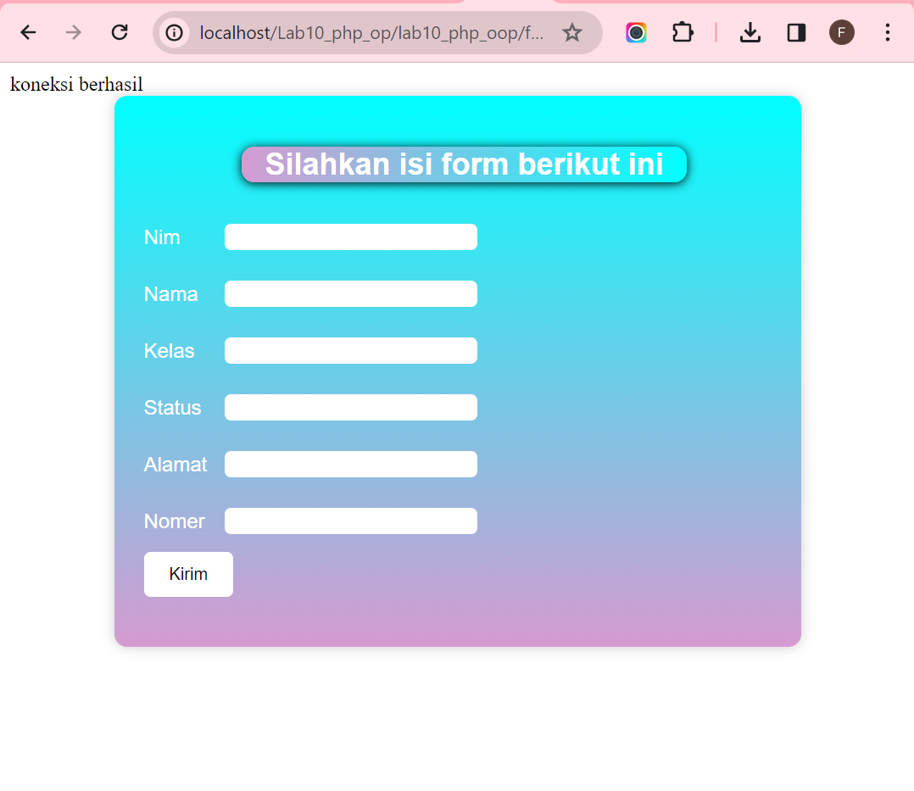
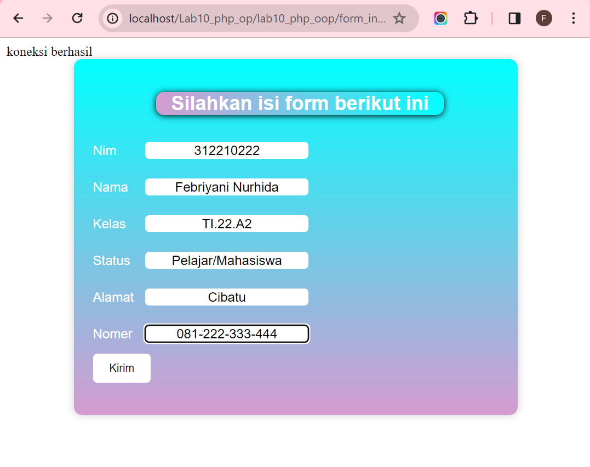
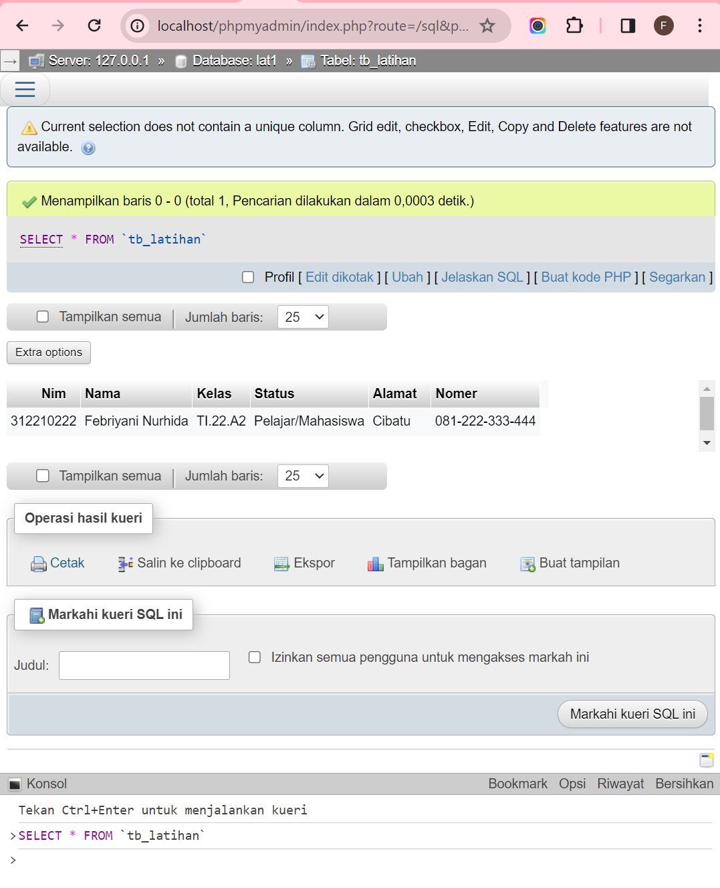
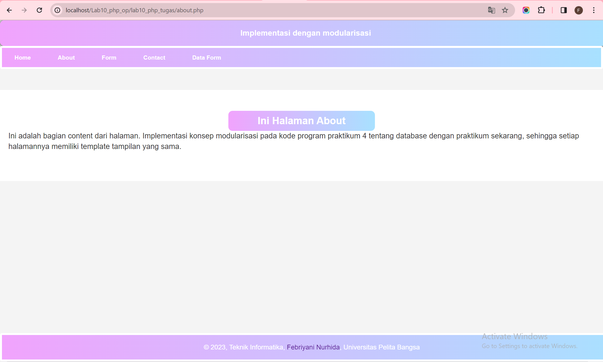

Nama : Febriyani Nurhida

Kelas : TI.22.A.2

Nim : 312210222

Mata Kuliah : Pemrograman Web 1

<h1> Praktikum 11 OOP PHP LANJUTAN  </h1>

1. Membuat tabel untuk biodata di database
```
CREATE TABLE `tb_latihan` (
  `Nim` int(50) NOT NULL,
  `Nama` varchar(100) NOT NULL,
  `Kelas` varchar(50) NOT NULL,
  `Status` text NOT NULL,
  `Alamat` text NOT NULL,
  `Nomer` varchar(50) NOT NULL
) ENGINE=InnoDB DEFAULT CHARSET=utf8mb4;
```


2.  Menampilkan pesan koneksi berhasil terhubung ke database
caranya, buat file config.php dulu
```
<?php

class config
{
  const host = "localhost";
  const db_name = "lat1";
  const username = "root";
  const password = "";
}


echo "koneksi berhasil";
```




2. Class Library
Class library merupakan pustaka kode program yang dapat digunakan bersama pada beberapa file yang berbeda (konsep modularisasi). Class library menyimpan fungsi-fungsi atau class
object komponen untuk memudahkan dalam proses development
aplikasi.
Contoh class library untuk membuat form.
Buat file baru dengan nama form.php

```
<?php

// Nama Class: Form
// Deskripsi: CLass untuk membuat form inputan text sederhana
class Form
{
  private $fields = array();
  private $action;
  private $submit;
  private $jumField = 0;

  public function __construct($action, $submit)
  {
    $this->action = $action;
    $this->submit = $submit;
  }

  public function displayForm()
  {
    echo "<form action='" . $this->action . "' method='POST'>";
    echo '<table>';
    for ($j = 0; $j < count($this->fields); $j++) {
      echo "<tr><td>" . $this->fields[$j]['label'] . "</td>";
      echo "<td><input type='text' name='" . $this->fields[$j]['name'] . "'></td></tr>";
    }
    echo "<tr><td colspan='2'>";
    echo "<input type='submit' name='" . $this->submit . "' class='submit-button'> </td></tr>";
    echo "</table>";
  }

  public function addField($name, $label, $value,)
  {
    $this->fields[$this->jumField]['name'] = $name;
    $this->fields[$this->jumField]['label'] = $label;
    $this->fields[$this->jumField]['value'] = $value;
    $this->jumField++;
  }
}
```


File tersebut tidak dapat dieksekusi langsung, karena hanya berisi deklarasi class. Untuk
menggunakannya perlu dilakukan include pada file lain yang akan menjalankan dan harus
dibuat instance object terlebih dulu.
Contoh implementasi pemanggilan class library form.php
Buat file baru dengan nama form_input.php

```
<!-- Program memanfaatkan Program 5.2 untuk membuat form inputan sederhana. -->
<?php
include "database.php";
$database = new database();

if (isset($_POST['submit'])) {
  $data = [
    'Nim' => $_POST['txtNim'],
    'Nama' => $_POST['txtNama'],
    'Kelas' => $_POST['txtKelas'],
    'Status' => $_POST['txtStatus'],
    'Alamat' => $_POST['txtAlamat'],
    'Nomer' => $_POST['txtNomer']
  ];
  $database->insert('tb_latihan', $data);
  // Menampilkan notifikasi jika data berhasil disimpan
  echo "<script>alert('Data berhasil disimpan')</script>";
}
?>
<html>

<head>
  <title>Identitas Mahasiswa</title>
  <link rel="stylesheet" href="style.css">
</head>

<body>
  <div class="form-container">
    <h2 style="margin-left: 80px;">Silahkan isi form berikut ini</h2>
    <?php
    include "form.php";
    $form = new Form("form_input.php", "submit");
    $form->addField("txtNim", "Nim", "form-input");
    $form->addField("txtNama", "Nama", "form-input");
    $form->addField("txtKelas", "Kelas", "form-input");
    $form->addField("txtStatus", "Status", "form-input");
    $form->addField("txtAlamat", "Alamat", "form-input");
    $form->addField("txtNomer", "Nomer", "form-input");
    $form->displayForm();
    ?>
  </div>
</body>

</html>
```


outputnya:



Contoh lainnya untuk database connection dan query. Buat file dengan nama database.php

```
<?php
class database
{
  protected $host;
  protected $user;
  protected $password;
  protected $db_name;
  protected $conn;

  public function __construct()
  {
    $this->getConfig();
    $this->conn = new mysqli(
      $this->host,
      $this->user,
      $this->password,
      $this->db_name
    );
    if ($this->conn->connect_error) {
      die("Connection failed: " . $this->conn->connect_error);
    }
  }
  private function getConfig()
  {
    include_once("config.php");
    $this->host = config::host;
    $this->user = config::username;
    $this->password = config::password;
    $this->db_name = config::db_name;
  }

  public function query($sql)
  {
    return $this->conn->query($sql);
  }

  public function get($table, $where)
  {
    $sql = "SELECT * FROM " . $table . " WHERE " . $where;
    $sql = $this->conn->query($sql);
    $sql = $sql->fetch_assoc();
    return $sql;
  }

  public function insert($table, $data)
  {
    if (is_array($data)) {
      foreach ($data as $key => $val) {
        $column[] = $key;
        $value[] = "'{$val}'";
      }
      $columns = implode(",", $column);
      $values = implode(",", $value);
    }
    $sql = "INSERT INTO " . $table . " (" . $columns . ") VALUES (" . $values . ")";
    $sql = $this->conn->query($sql);
    if ($sql == true) {
      return $sql;
    } else {
      return false;
    }
  }

  public function update($table, $data, $where)
  {
    $update_value = [];
    if (is_array($data)) {
      foreach ($data as $key => $val) {
        $update_value[] = "$key='{$val}'";
      }
      $update_value = implode(",", $update_value);
    }

    $sql = "UPDATE " . $table . " SET " . $update_value . " WHERE " . $where;
    $sql = $this->conn->query($sql);
    if ($sql == true) {
      return true;
    } else {
      return false;
    }
  }

  public function delete($table, $filter)
  {
    $sql = "DELETE FROM " . $table . " " . $filter;
    $sql = $this->conn->query($sql);
    if ($sql == true) {
      return true;
    } else {
      return false;
    }
  }
}
```


3. Menampilkan dan membuat form input data, lalu ketika di submit akan tersimpan datanya di database




4. Menampilkan pesan "localhost says" yang tandanya data sudah berhasil disimpan


5. Ketika kita lihat, bahwa data yang sudah di input tadi akan masuk ke dalam database



<h1> Pertanyaan dan Tugas</h1>

Implementasikan konsep modularisasi pada kode program pada praktukum sebelumnya
dengan menggunakan class library untuk form dan database connection.

1. Membuat file untuk menampilkan data (read)

```
<?php
$mod = isset($_REQUEST['mod']) ? $_REQUEST['mod'] : 'default';
switch ($mod) {
  case "data_barang":
    require("index.php");
    break;
  case "index":
    require("index.php");
    break;
  case "about":
    require("about.php");
    break;
  case "form_input":
    require("form_input.php");
    break;
  case "contact":
    require("contact.php");
    break;
  case "data":
    require("data.php");
    break;
  default;
    require("index1.php");
}
```


2. Menambah Data (Create)


3. Mengubah Data (Update)


4. Menghapus Data (Delete)


5. Masuk ke menu "about" sama seperti praktikum sebelumnya dan dibagian isi sudah saya jelaskan




6. Masuk ke menu "form" header dan footer merupakan implementasi praktikum sebelumnya, dan dibagian content membuat form input data ketika di submit akan tersimpan datanya di database


7. Menampilkan pesan "localhost says" yang tandanya data sudah berhasil disimpan


8. Ketika kita lihat, bahwa data yang sudah di input tadi akan masuk ke dalam database phpmyadmin


9. Masuk ke menu "contact" sama seperti praktikum sebelumnya dan dibagian isi sudah saya jelaskan


10. Masuk ke menu "data form" menampilkan data dalam bentuk tabel yang sudah tadi kita input, dimana datanya tersebut sudah masuk ke dalam database phpmyadmin


11. Klik pada bagian menu aksi yaitu button update dan pilih data yang ingin di ubah.


12. Maka data tersebut berhasil di update/ubah


13. Klik pada bagian menu aksi yaitu button delete dan pilih data yang ingin di hapus, semisalkan disini rifky abdillah hasan dihapus dan data sudah berhasil terhapus


<p> Sekian dan Terima Kasih </p>
